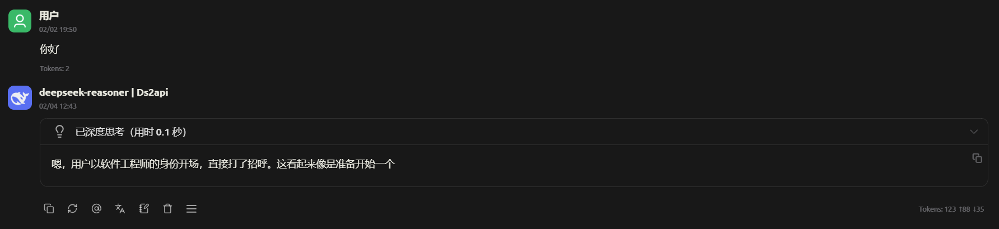

# Krypton

**Name**
Krypton

**Description**
Krypton is a high-performance HTTP reverse-proxy gateway with health checks, weighted load balancing, retry policies, and scriptable behaviors via Starlark. It is designed to sit in front of multiple upstream nodes and route requests based on live health and weighted scheduling. The optional Admin API is exposed under `/.krypton/` when enabled.

**Badges**


**Visuals**


**Installation**
Requirements:
- Go 1.22+ (from `go.mod`)
- A `config.toml` pointing to at least one upstream node

Option 1: Use prebuilt binaries from GitHub Releases (including pre-releases).

Option 2: Build from source.
```powershell
Copy-Item example.config.toml config.toml
go build -o krypton.exe .
```

**Usage**
1. Copy and edit the config.
```powershell
Copy-Item example.config.toml config.toml
```
2. Update `[[nodes]]` addresses and keys in `config.toml`.
3. Run the server.
```powershell
go run .
```

Common options:
- `KRYPTON_LOG_LEVEL=debug|info|warn|error`
- Enable Admin API in `config.toml` and access it at `/.krypton/`

Docs:
- `docs/README.md` (English index)
- `docs/zh_cn/README.md` (中文索引)

**Support**
- GitHub Issues: https://github.com/AmethystDev-Labs/Krypton/issues

**Roadmap**
- Public roadmap and milestones live in GitHub Issues/Milestones.

**Contributing**
- Fork the repo and create a feature branch.
- Format code with `gofmt`.
- Run `go vet ./...` and `go test ./...` before submitting a PR.
- Keep config and docs updates in sync with code changes.

**Authors And Acknowledgment**
- AmethystDev-Labs and community contributors.

**License**
GPL-3.0. See `LICENSE`.

**Project Status**
Pre-release. Interfaces and behavior may change before a stable release.
