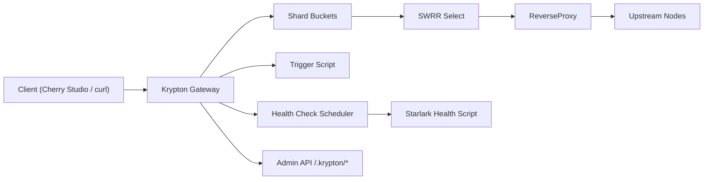

# Architecture

Key principles:
1. **SWRR scheduling**: Smooth Weighted Round Robin inside shards.
2. **Sharded locks**: bucket mutex to reduce contention at high QPS.
3. **Atomic weights**: `effectiveWeight` updated via atomic operations.
4. **Dual scores**: `passiveScore` from request outcomes, `activeScore` from health checks.
5. **Min-score fusion**: effective weight derives from `min(passiveScore, activeScore)`.
6. **Fail fast**: immediate downgrade on failures.
7. **Slow recovery**: gradual ramp-up on success.
8. **Scripted logic**: Starlark for health and trigger behavior.
