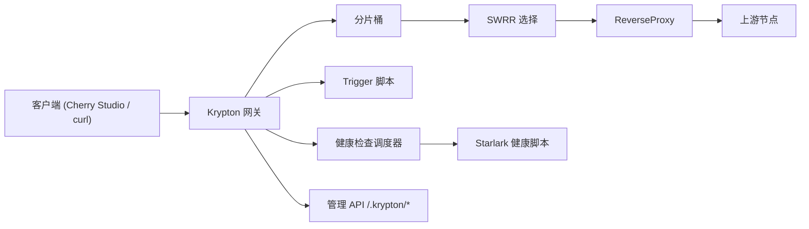

# 架构说明

关键设计：
1. **SWRR**：平滑加权轮询
2. **分片锁**：降低高并发锁争用
3. **原子权重**：`effectiveWeight` 原子更新
4. **双评分**：被动 + 主动
5. **取最小值**：融合被动与主动评分
6. **失败快速降权**：Fail Fast
7. **成功平滑恢复**：Slow Recovery
8. **脚本化逻辑**：Starlark 驱动检查与触发
